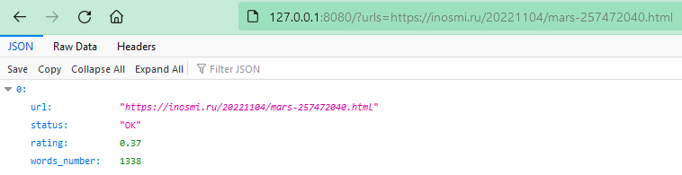

# Filter of jaundice news

The program can rate news articles from [inosmi.ru](https://inosmi.ru/).

## Prerequisites

Python 3.10 is required.

## Installing

- Download the project files.
- It is recommended to use [venv](https://docs.python.org/3/library/venv.html?highlight=venv#module-venv) for project isolation.
- Set up packages:

```bash
pip install -r requirements.txt
```

## Using scripts

### Script "server"

- Run server:

```bash
python server.py
```

- To check interactively that the server is running, you can follow [this test link](http://127.0.0.1:8080/?urls=https://inosmi.ru/20221104/mars-257472040.html):



### Script "client"

- The script requests the analysis of articles from the server (script "server" must be running as described above);

- Run:

```bash
python client.py
```

- The command above will analyze default articles:
  - [not existing article](https://inosmi.ru/not/exist.html);
  - [not existing domain](https://inosmiy.ru/20221106/virusy-257514193.html);
  - [an article about video games on inosmi.ru](https://inosmi.ru/20221106/videoigry-257474918.html);
  - [an article about ostriches on lenta.ru (unsupported resource)](https://lenta.ru/news/2022/11/27/20_strausov/);
  - [an article about the Mars on inosmi.ru](https://inosmi.ru/20221104/mars-257472040.html);
  - [an article about lobster on  inosmi.ru](https://inosmi.ru/20221127/bessmertie-258272850.html)

- You can specify URLs of articles (separate them with commas, up to 10 URLs can be processed), e.g.:

```bash
python client.py --urls https://inosmi.ru/20221127/bessmertie-258272850.html,https://inosmi.ru/20221104/mars-257472040.html
```

- To find out more, run:

```bash
python client.py -h
```

## Tests

The project uses [pytest](https://docs.pytest.org/en/latest/). Run tests with:

```bash
python -m pytest adapters/inosmi_ru.py -v
```

```bash
python -m pytest text_tools.py -v
```

```bash
python -m pytest server.py -v
```

## Project goals

The project was created for educational purposes.
It's a lesson for python and web developers at [Devman](https://dvmn.org/).
